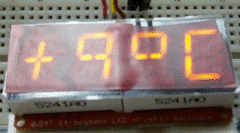

# Seg14

**Seg14** is a simple Arduino library for driving 14-segment displays
with a HT16K33. The letters in small `t`, `g`, `f`, `x` are ugly. Some
non number or letter chars exists, too. 

Code based on https://github.com/rileyjshaw/Seg16 for 16-segment
displays (author: Riley Shaw).



## Usage

```.cpp
// Basic hello world.
//
// This sketch displays the word "Hand" across four 14-segment displays.
// After 2s the displays shows "No ?".
//
// Hardware setup: attach four 14-segment displays to a HT16K33 at address 0x70.
//
#include "Seg14.h"

Seg14 segments(4, 0x70);

enum Letters {A, B, C, D, E, F, G, H, I, J, K, L, M, N, O, P, Q, R, S, T, U, V, W, X, Y, Z};

void setup() {
	segments.init();
	segments.writeStream(Seg14::getUpper(H));
	segments.writeStream(Seg14::getLower(A));
	segments.writeStream(Seg14::getLower(N));
	segments.writeStream(Seg14::getLower(D));
	delay(2000);
	segments.print("No ?");
}

void loop() {
}
```

See the [examples directory](/examples) for full working code examples.

## Methods

```.cpp
// Seg14 class, use to instantiate a new HT16K33.
Seg14(uint8_t nDisplays = 1, uint8_t address = 0x70);

// Starts the HT16K33 with sensible defaults. Call once in setup().
void init();

// Low-level calls, might be useful for energy-saving / power-down.
void setOscillatorOn(bool on);
void setDisplayOn(bool on);

// Change the brightness. Expects an int from 0 to 15.
// Duty cycle = (brightness + 1) / 16, so brightness = 0 is still on.
// To shut the display off, use setDisplayOn(false).
void setBrightness(uint8_t brightness);

// 0: blink off.
// 1: blink at 2HZ.
// 2: blink at 1HZ.
// 3: blink at 0.5HZ.
void setBlinkMode(uint8_t mode);

// Static helper methods; return characters to use with write() or writeStream().
// Index range [0 - 83], returns characters in the order decimal, upper, lower.
static uint16_t getCharacter(uint8_t index);
// Index range [0 - 9], returns that number as a decimal character. 
static uint16_t getDecimal(uint8_t index);
// Index range [0 - 15], returns that number as a hexidecimal character.
static uint16_t getHex(uint8_t index);
// Index range [0 - 25], returns that number as an uppercase letter.
static uint16_t getUpper(uint8_t index);
// Index range [0 - 25], returns that number as an lowercase letter.
static uint16_t getLower(uint8_t index);

// Write a character to a specific display 0-7.
void write(uint16_t character, uint8_t displayIndex = 0);

// Write to several displays in the same transmission. For
// instance, if three displays are hooked up, calling:
//     for (int i = 0; i < 3; ++i) writeStream(Seg16::getUpper(0));
// will write the letter “A” to each of them.
// startIndex and endIndex can be specified for partial updates.
uint8_t writeStream(uint16_t character, uint8_t startIndex = 0);
uint8_t writeStream(uint16_t character, uint8_t startIndex, uint8_t endIndex);

// with 4 displays you can print 4 letters and some other chars
void print(const char * letters, uint8_t i = 0);
```

## Hardware

Note: for the font to render as expected, hook displays up like this:

```
       0
   +-------+
   |\  |  /|
 5 | 8 9 A | 1
   |  \|/  |
   +-6-+-7-+
   |  /|\  |
 4 | B C D | 2
   |/  |  \|    _
   +-------+   |E|
       3
```

## Similar libraries

- https://github.com/rileyjshaw/Seg16
- https://github.com/adafruit/Adafruit_LED_Backpack
- https://github.com/jonpearse/ht16k33-arduino

## License

[GNU GPLv3](LICENSE.md)
